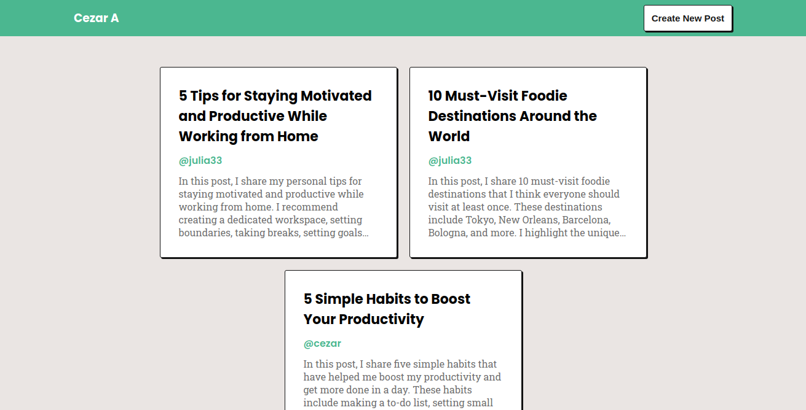
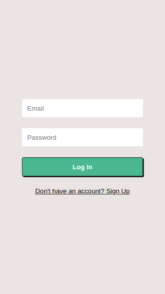
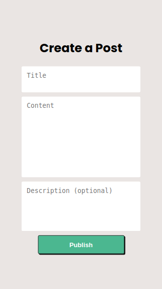

# Blog API

The **Blog App** is a platform designed to connect writers. A place where you can share your ideas and engage with a community.
The app provides a collaborative environment where users can express themselves and participate in different discussions.

On the main page you find the latest posts made by the community.



Create a new account or log in to an existing account to have access to extra features.





You can also publish your own posts.




## Routes

The routes are separated into two categories, "Users" and "Posts", and two subcategories, "Likes" and "Comments".

With "Users", you can register a new account or log in to an existing one.

With "Posts", you can access all the posts, create your own post, like, and add comments to existing posts.

<details>
<summary>
<strong>Users</strong>
</summary>

**Register a new account**
```
POST /users/register
```
Body:
```
{
  "email": "refael@email.email",
  "password": "refaelpassword",
  "username": "refael5",
  "name": "Rafael"
}
```

**Log in to an account**
```
POST /users/login
```
Body:
```
{
  "email": "refael@email.email",
  "password": "refaelpassword"
}
```

**Validate a token**
```
  POST /users/validate
```
Headers:
```
{
  "authorization": "eyJ...4Rc"
}
```

**Return the profile of a user**
```
  GET /users/${username}
```

</details>
<details>
<summary>
<strong>Posts</strong>
</summary>

**Return all posts**
```
GET /posts
```

**Return a specific post**
```
GET /posts/${id}
```

**Create a new post**
```
POST /posts
```
Headers:
```
{
  "authorization": "eyJ...4Rc"
}
```
Body:
```
{
  "title": "New Post",
  "content": "This is the content of the new post.",
  "description": "A brief description of the post."
}
```
</details>
<details>
<summary>
<strong>Likes</strong>
</summary>
  
**Return the number of likes on a post**
```
  GET /posts/${id}/likes
```

**Check if the user has liked a post**
```
  GET /posts/${id}/liked
```
Headers:
```
{
  "authorization": "eyJ...4Rc"
}
```

**Like a post**
```
  POST /posts/${id}/likes
```
Headers:
```
{
  "authorization": "eyJ...4Rc"
}
```

**Unlike a post**
```
  DELETE /posts/${id}/likes
```
Headers:
```
{
  "authorization": "eyJ...4Rc"
}
```
</details>
<details>
<summary>
<strong>Comments</strong>
</summary>

**Return comments from a post**
```
  GET /posts/${id}/comments
```

**Add a new comment to a post**
```
  POST /posts/${id}/comments
```
Headers:
```
{
  "authorization": "eyJ...4Rc"
}
```
Body:
```
{
  "content": "New comment."
}
```
</details>

## Technologies used

- JavaScript
- TypeScript
- Node.js
- Express
- Sequelize

## Run locally

Clone the project.

```bash
git clone https://github.com/telesleo/blog-backend.git
```

Enter the directory.

```bash
cd blog-backend
```

Install the dependencies.

```bash
npm install
```

Run the database and the server with docker-compose

```bash
docker-compose up
```

## Environment variables

`DB_USERNAME` The Username for the database.

`DB_PASSWORD` The Password for the database.

`DB_NAME` The name of the database.

`DB_HOST` The host of the database.

`DB_PORT` The port of the database.

`JWT_SECRET` The secret key for the JSON Web Token authentication.

`ORIGIN` The URL of the client application.

-----

Check out the frontend of this project [here](https://github.com/telesleo/blog-frontend).

:)
